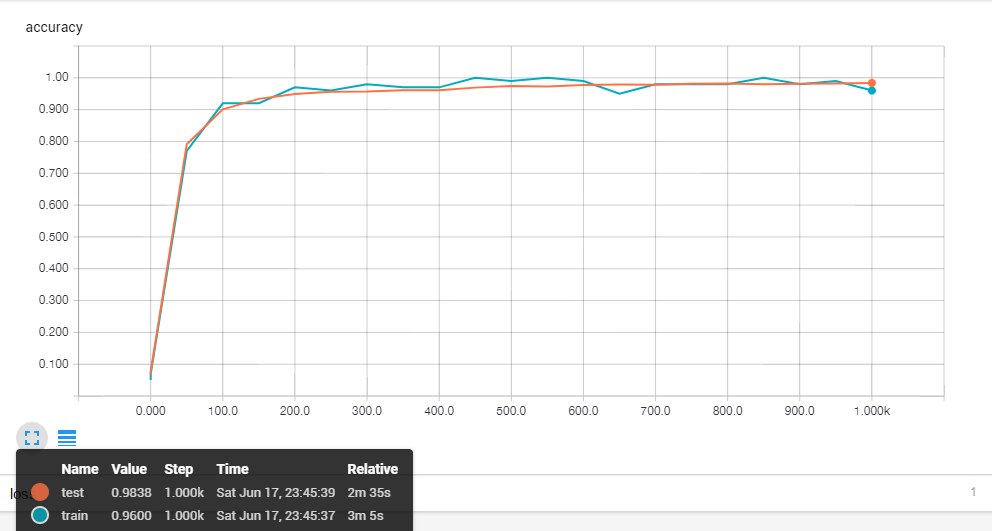
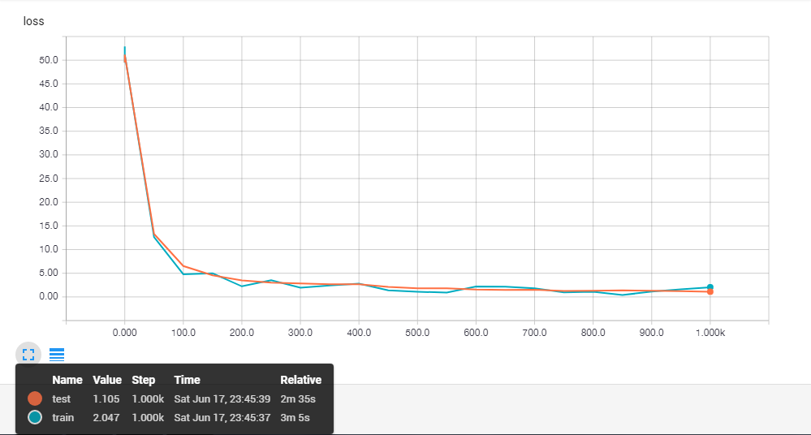

Tensorflow model for deep convolutional MNIST classifier

This project contains classifier for MNIST dataset using deep neural netwroks. Starting with simple single layer, it extends to multilayer network and then using Convolutional neural network for classification. It also includes tensorboard visualization of scalars, like accuracy, loss, weights and biases.

To visualize the graph and loss during training, run: 
```
tensorboard --logdir=logs
```
Below are few plots for cnn ran over 1000 iterations, with decaying learning rate:
Accuracy plot: 



Loss plot: 




